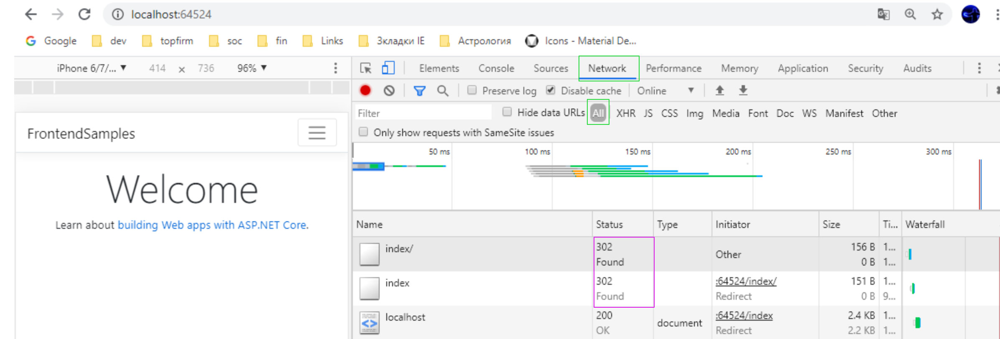

[← Примеры Razor Pages](/README.md)  

# Canonical url - Канонический адрес страницы

## Удаление дубликатов Index и / (слеш)
Стадартно Razor Pages используют Index как документ по умолчанию, который не обязательно указывать в URL. Но, если вы его укажете, то откроется та же страница, и у вас возникнет дублирование страниц - когда по разным адресам открывается одна и та же страница. То же самое происходит, если указать слеш в конце url.

Чтобы предовратить это поведение, добавьте в _Startup.cs_ в метод  `Configure(IApplicationBuilder app, IWebHostEnvironment env)` перед `app.UseStaticFiles();` следующий код:
```
//ПРЕДВАРИТЕЛЬНО:
var rewriteOptions = new RewriteOptions()
     .AddRedirect("(.*)/$", "$1")    //убираем слеж в конце адреса
     .AddRedirect("((?i)(index))$", "/");  //убираем дубликат стартовой страницы; (?i) это ignorecase
app.UseRewriter(rewriteOptions);
```
и необходимые пространства имен `using Microsoft.AspNetCore.Rewrite;`  
Запустите и протестируйте проект - страница Index не будет отображаться в url.  
📘 [Переопределения URL-адресов в ASP.NET Core](https://docs.microsoft.com/ru-ru/aspnet/core/fundamentals/url-rewriting?view=aspnetcore-3.1)

* **Как отвечает сервер**  
Посмотрим, что происходит на сервере, если ввести в url страницу по умолчанию, и слеш в конце. Для этого будем использовать средство диагностики броузера, открывается, если нажать F12, вкладка [Network]

<p align="center">
     
</p>

Мы видим, что сервер пытался открыть страницу _index/_ со слешем, потом просто _index_, и только потом корневую страницу. Во время редиректов возвращается код 302, что означает, что такая страница как бы есть, но временно перемещена. Для поискового робота, это сигнал проверить позже, а не появилась ли такая страница снова.  
📘 [Как Яндекс обрабатывает внутрихостовые редиректы?](https://yandex.ru/support/webmaster/robot-workings/managing-redirects.html#internal-redirects)  
📘 [Яндекс: Дублирование страниц](https://yandex.ru/support/webmaster/robot-workings/double.html)  

* **Редирект 301**  
Давыйте теперь сократим количество редиректов для _index_ страниц до одного, и сделаем это редирект с кодом 301 - для поисковика это означает, что страница теперь постоянно находится по этому адресу, и всё хорошее, что было связано с этой страницой, например внешние ссылки, надо теперь связать с новой страницей.

```
var rewriteOptions = new RewriteOptions()
    .AddRedirect("(.*)/index/*$", "$1", 301)  //убираем дубликаты внутренних страниц
    .AddRedirect("(.*)index/*$", "$1", 301)  //убираем дубликат главной страницы по умолчанию;
    .AddRedirect("(.*)/$", "$1", 301);    //убираем слеж в конце адреса для других страниц 
```
Здесь мы сначала удаляем дубликаты по умолчанию вместе со слешем, если он есть. Для других страниц, просто удаляет слеш в конце.  
Возможно есть более удачное регулярное выражение, чтобы не добавлять отдельную строку для главной страницы. Выражение `/*index/*` не срабатывает для стартовой страницы Тестирование проводилось для адресов `http://localhost:64524/canonical/index/` и `http://localhost:64524/index/`. Причем редирект хотелось получить только один.

✔ ВНИМАНИЕ: В данном коде везде применяется 301 редирект, но это надо обязательно проверить уже **на рабочем сервере**, возможно, ему, наоборот требуется слеш в конце - тогда надо будут подправить этот код.  

Протестируйте работу на главной странице, внутренней странице, и переход по ссылке на главную страницу. Адрес в такой ссылке выглядит как слеш `href="/"`- проверте, что **главная страница открывается без редиректов** - это важно, чтобы ваш собственный сайт не генерировал ошибочные ссылки.

📘 [Язык регулярных выражений — краткий справочник](https://docs.microsoft.com/ru-ru/dotnet/standard/base-types/regular-expression-language-quick-reference?view=netframework-4.8)  
🔖 [Regex Tester - онлайн тестирование регулярных выражений](http://regexstorm.net/tester)

## Удаление дубликатов WWW и технологического адреса сервера

Должен быть только один адрес сайта, с WWW или наоборот без него, и при наборе дубликата, должен быть 301 редирект на основной адрес.   Кроме того, когда вы размещаете сайт у хостинг провайдера, используется некоторый внутренний технологический адрес сайта. Например, при размещении в Azure у вашего сайта появится внутренний адрес наподобии _{некоторое_уникальное_имя}.azurewebsites.net_. У других провайдеров имя может быть другим, но, главное - по этому адресу ваш сайт будет также доступен, и если вы надеетесь, что это имя никто не узнает, то на пратике это не так.

* **Перезапись URL на IIS**  
Давайте избавимся от этих дубликатов, но несколько иным способом - с помощью файла конфигурации для IIS, тогда такие запросы будут обрабатываься сервером, и даже не попадуть в нашу программу - и это быстрее.

Добавьте файл веб конфигурации  _web.config_ в проект.  
(При добавлении нового элемента он находися в разделе Visual _C# > ASP.NET Core > Веб > ASP.NET_)

```
<configuration>
  <system.webServer>
    <rewrite>
      <rules>
        <rule name="Redirect SITEname" patternSyntax="ECMAScript" stopProcessing="true">
          <match url=".*"/>
          <conditions logicalGrouping="MatchAny">
            <add input="{HTTP_HOST}" pattern="^hosting-site-name.azurewebsites.net$" />
            <add input="{HTTP_HOST}" pattern="^www\.(.*)$" />
          </conditions>
          <action type="Redirect" url="http://site.ru/{R:0}" redirectType="Permanent"/>
        </rule>
      </rules>
    </rewrite>
  </system.webServer>
</configuration>
```
Это все надо тестировать на своем сервере - там могут быть различные настройки провайдера. Лично я обхожусь без правила 
```
<add input="{HTTP_HOST}" pattern="^www\.(.*)$" />
```
а в правиле 
```
 <add input="{HTTP_HOST}" pattern="^hosting-site-name.azurewebsites.net$" />
 можно добавить
 <add input="{HTTP_HOST}" pattern="^hosting-site-name.azurewebsites.net(.*)$" />
```
но при тестировании все работает как надо, и сервер корректно отвечает 301 редиректом на кривые адреса.

📘 [Справочник по настройке модуля перезаписи URL, web.config](https://docs.microsoft.com/ru-ru/iis/extensions/url-rewrite-module/url-rewrite-module-configuration-reference)  
⬜ [10 советов по переписыванию URL для IIS](https://ruslany.net/2009/04/10-url-rewriting-tips-and-tricks/) 

## Канонический адрес страницы, rel="canonical" 
Мы поработали над устраннием дублей, теперь пора добавить правильный канонический адрес, и желательно делать это в автоматическом режиме.  
Добавьте в файл __Layout.cshtml_ в самое начало код, формирующий канонический адрес страницы:
```
@{
    //Каноническая ссылка
    string path = Context.Request.Path.HasValue ? Context.Request.Path.Value.ToLower().TrimEnd('/') : string.Empty;
    if (path.EndsWith("/index")) path = path.Remove(path.Length - 6); //избыточно: перестраховка для редиректа
 }
```
Этот код не учитывает параметры запроса, в большинстве случаев как раз это и требуется, хотя есть и свойство `HttpRequest.QueryString` для отображения строки запроса.  
📘 [Доступ к HttpContext в ASP.NET Core](https://docs.microsoft.com/ru-ru/aspnet/core/fundamentals/http-context?view=aspnetcore-3.1)  
📘 [HttpRequest.Path](https://docs.microsoft.com/ru-ru/dotnet/api/system.web.httprequest.path?view=netframework-4.8)  

Теперь добавим канонический адрес страницы в заголовок днной страницы. В разделе `<head>`, после тега `<title>`:
```
 <link rel="canonical" href="http://site.ru@(path)">
```
Вместо _http:// site.ru_ поставьте домен вашено сайта.  
📘 [Яндекс: канонический адрес страницы](https://yandex.ru/support/webmaster/robot-workings/canonical.html#canonical__set-canonical)    

* Важные замечания:  
• Сканирование канонического URL будет выполняться намного чаще, чем его копий.  
• Присутствие URL в файле Sitemap. Если вы используете xml-карту сайта, то включите туда все канонические url, в точности так, как на странице. И наоборот, не включайте в файл Sitemap неканонические страницы.  

📘 [Google: Как консолидировать повторяющиеся URL](https://support.google.com/webmasters/answer/139066?hl=ru)  
⬜ [полное руководство по использованию канонических ссылок](https://seoprofy.ua/blog/optimizaciya-sajtov/rel-canonical)  

<br /><br />
<p align="center">
  Практические консультации вы можете получить на наших <a  href="http://creativcode.ru/learn" target="_blank" >веб курсах в Сочи, Адлер</a>:<br /><br />
   <a  href="http://creativcode.ru/learn/webnet" target="_blank" title="Курс веб программирования .Net C#" >
  
   </a>
</p>
